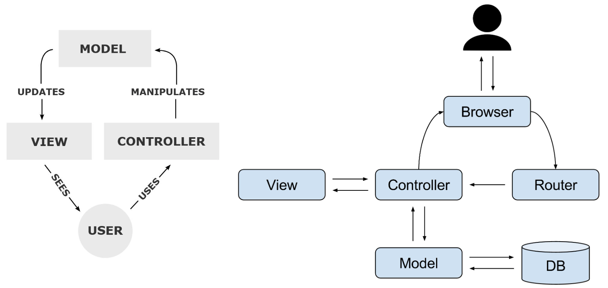
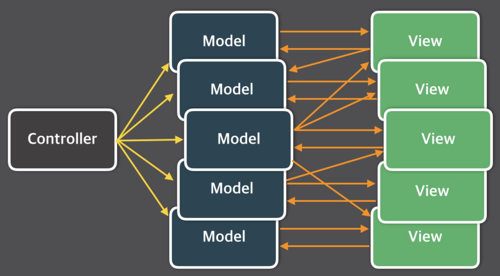

MVC (Model view controller)
---
MVC란 소프트웨어 디자인 패턴으로써 이 패턴을 성공적으로 사용하면 
사용자 인터페이스로부터 비즈니스 로직을 분리하여 애플리케이션의 시각적 요소나 실행되는 비즈니스 로직을 서로 영향없이 쉽게 고칠 수 있는 애플리케이션을 만들 수 있다.
* Model : 모델의 상태가 변할 때 컨틀로러와 뷰에 이를 통보한다. 이를 통해 뷰는 최신의 결과를 볼 수 있고, 컨트롤러는 모델의 변화에 따른 적용 가능한 명령을 추가-제거 할 수 있다.
* view : 사용자가 볼 결과물을 생성하기 위해 모델로부터 정보를 얻어온다.
* controller : 모델에 명령을 보냄으로써 모델의 상태를 변경할 수 있다. (예: 워드 프로세서에서 문서를 편집하는 것) 또, 컨트롤러가 관련된 뷰에 명령을 보냄으로써 모델의 표시 방법을 바꿀 수 있다. (문서를 스크롤하는 것)

간단히 정리해 보자면 
MVC는 개발할 때 3가지로 구분하여 개발하는 소프트웨어 개발 방법론인데.
이를 세부적으로 보자면 
model : 무엇을 할지 정하는 로직 
view : 화면에 직접적으로 보여지는 것 
controller : model과 view를 연결시켜 어떻게 처리할 것인지 결정

정도가 될 것이다.
### 이점
* 유지보수의 편리성

UI 시스템을 위한 책임을 기준으로 3개의 핵심 컴포넌트 모델, 뷰, 컨트롤러라는 책임을 나누어
각 컴포넌트가 자신의 수행 결과를 다른 컴포넌트에게전달하는 프로그래밍 방식으로 결합도를 낮췄다.
  따라서 시스템 유지보수 시에도 **특정 컴포넌트만 수정**하면 되기 때문에 보다 쉬운 시스템 변경이 가능하다.

~~감히 예상해보건데 view는 프론트엔드, Controller는 백엔드 정도로 생각하면 되겠다~~

### 문제점 (Massive-View-Controller)
겉보기르는 엄청 좋아보일 것 같지만 
이 MVC 패턴으로 프로젝트를 진행할 때 문제점이 있다. 
바로 **복잡한 대규모 프로그램을 개발**할 때이다

다수의 View와 Model이 Controller를 통해 복잡하게 연결될 수 있기 때문에 Controller가 무거워진다.
<pre>
View와 Controller가 라이브사이클에 강하게 연결되어있고, 더불어 Controller를 통해 View와 Model간에도 관계가 복잡하게 연결되어있어서 수정시 테스트가 힘들고, 파악이 어렵기 때문에 여러 Side-Effect를 불러오게 되는 문제점이 있다
</pre>
위와 같은 상황을 **Massive-View-Controller**이라 한다.

### Massive-View-Controller
