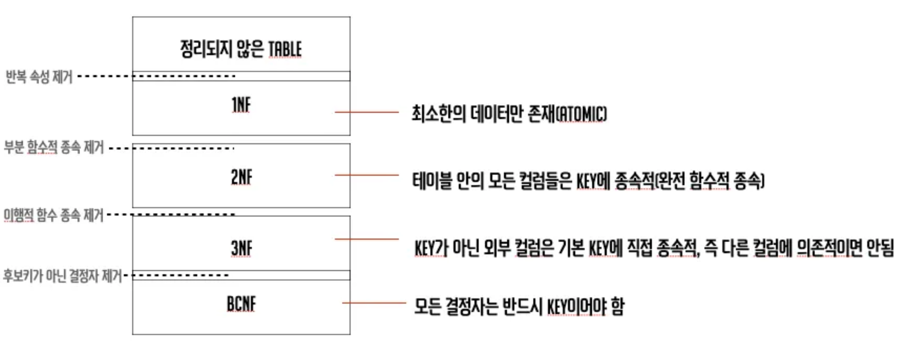

MySQL
====
* MySQl이란 전 세계에서 가장 많이 사용되는 데이터베이스 중에 하나
*  Drupal, Joomla, Magento, WordPress 등 전자상거래 웹사이트, 소셜 미디어 및 애플리케이션에서 널리 사용
*  Linux-Apache-MySQL-PHP/Perl/Python(LAMP) 웹 애플리케이션 스택의 핵심 부분
    * LAMP Stack이란 WAS를 빌드, 배포할 시 사용되는 무료 오픈소스 구성요소의 번들을 뜻한다.
    * LAMP의 각 요소는 다음과 같다
        * Linux - 운영체제
        * Apache - 서버
        * **MySQL** - 데이터베이스
        * PHP, Perl, Python - 프로그래밍 언어
    ### LAMP
    

기본적으로 MySQL은 애플리케이션 데이터를 저장하기 위한 오픈소스 관계형 데이터베이스이다 
다른 관계형 데이터베이스와 마찬가지로 **행과 열로 구성된 테이블**에 데이터를 저장한다. 

* MySQL은 오픈소스이므로 GNU 일반 공중 라이선스 약관에 따라 무료로 사용할 수 있다.

## MySQL의 이점
M*ySQL은 빠르고 안정적이며 확장 가능하며 사용하기 쉽다. 
* 데스크톱 또는 노트북에서 다른 애플리케이션, 웹 서버 등과 함께 원활하게 실행할 수 있다. 
* 전체 머신을 MySQL 전용으로 사용하는 경우, 사용 가능한 모든 메모리, CPU 전원, I/O 용량을 활용하도록 설정을 조정할 수 있다.

## 정규화 (Canonicalize)
데이터의 보존성을 높이는 등의 목적에서 데이터베이스 내에서 같은 정보가 2번 이상 기록되지 않고, 테이블 하나 하나는 주 키에서 직접 연상되는 데이터만으로 구성되도록 설계하는 것 
즉, 중복을 최소화하기 위해 데이터를 구조화하는 작업이다

이렇게 중복되는 데이터를 최소화시켜 데이터를 관리한다면 단위 정보의 크기가 작아지기 때문에 쿼리(Query)문을 통해 검색하고 입력하고 업데이트 등 **효율적이고 빠르게 관리할 수 있다**

### 데이터 정규화 과정

#### 제 1차 정규형
속성의 도메인이 오직 원자값만을 포함하여 하나의 값만을 가져야한다.  즉, 다중값 속성, 중첩 관계 등 비 자원적인 방식을 허용하지 않는다.
#### 제 2차 정규형
모든 비 주요 속성들이 주요 속성에 대해 완전 함수 종속이면 제 2 정규형을 만족한다.
#### 제 3차 정규형
어떠한 비주요 속성도 기본키에 대해서 이행적으로 종속되지 않으면 제 3 정규형을 만족한다
* 이행적 종속이란 X -> Y -> Z 관계일 때 X -> Z 임을 추론할 수 있는 관계를 뜻한다.
#### BCNF 정규형
복잡한 식별자 관계에 의해 발생하는 문제를 해결하기 위해 제 3 정규형을 보완하는데 의미가 있다. 함수적 종속성을 분해하는 과정을 말한다.

## 트랜잭션
정처리 = 실행 가능한 연산 단위이다
**연산 단위**라는 것을 좀 예시로 나타내보겠다
<pre>
지우는 한달에 50만원을 받는다
마침 11월 17일은 지우가 용돈을 받는 날이다.
그래서 지우의 부모님은 ATM으로 지우 계좌에 50만원을 보냈다. 
그러나 지우의 부모님의 계좌에서는 50만원이 빠져나갔지만,
지우의 계좌에는 50만원이 들어오지 않았다.
</pre>
위 상황은 정말 말도 안되는 있어서는 안되는 상황이다. 
계좌 이체는 **인출**과 **입금** 두 과정으로 이루어진다.
위와 같이 만약 인출은 성공했는데, 입금이 이루어지지 않는다면 트랜잭션에 오류가 있다고 보면 된다.

이로 유추할 수 있는 것은 위처럼 인출과 입금이라는 **과정**을 동시에 묶는 방법이 바로 트랜잭션이라는 것이다.

**데이터 거래(Transaction)에 있어서 안전성을 확보하기 위한 방법이 트랜잭션이다**

트랜잭션은 다음과 같은 특징이 있다.
* 원자성 : 모두 반영되거나, 전혀 반영되지 않아야한다.
* 일관성 : 트랜잭션의 결과는 항상 일관성 있어야한다.
* 독립성(격리성) : 둘 이상의 트랜잭션이 동시에 실행되면, 다른 트랜잭션은 끼어들 수 없다.
* 지속성(영속성) : 트랜잭션의 결과는 영구적으로 반영된다.

## 문법
### DDL

#### 테이블 생성
create table 테이블 명(
    속성 자료형 제약조건
);

### DML

#### 데이터 삽입
insert into 테이블 명 valeus(값1, 값2);
#### 데이터 검색
select 속성 from 테이블 명 where 조건;
#### 데이터 수정
update 테이블 명 set 수정 사항 where 조건;
